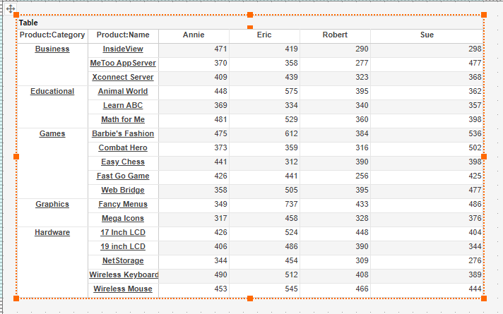
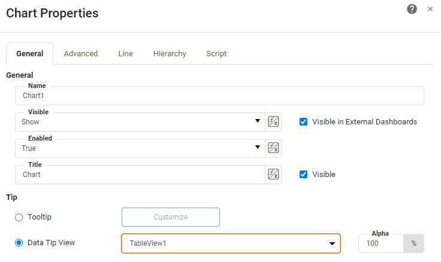

Should I use a table or a crosstab? This depends on whether you want to display row level data or display grouped and summarized data.

# Table of Contents

[Tables](#table)

[Crosstabs](#cross)

[Using the Visualization Recommender](#recommend)

[When should I use a table?](#table2)

[When should I use a crosstab?](#cross2)

[Different uses for a table](#table3)

[Alternatives to a table](#alt)

[What features are unique to a table?](#table4)

[What features are unique to a crosstab?](#cross3)

[What features do they have in common?](#common)

[Getting the best of both world with a freehand table](#freehand)

[Summary](#sum)

# Tables 

 
 
A simple flat table does not aggregate metrics; it simply displays individual detail level rows of the columns selected, limited only by dashboard filters.

# Crosstabs 

Crosstabs are for those who want to display data in summarized way, for when detail level data is left available at the dashboard level. Crosstabs always do grouping and summarization. When creating a crosstab, you select dimensions for row grouping, select dimensions for column groupings, and select the aggregation methods for the measures you choose. A crostab's default behavior is to merge  duplicate cells in  row and column headers.

# Using the Visualization Recommender for ideas 

If you're not sure what dashboard element you want, you can begin your search for the ideal oubput by using InetSoft's Visualization Recommender. This is the option that first appears when you create a dashboard. It selects an ideal dashboard output option based on which columns from the dataset are selected. 

 

 Using the Recommender wizard can help you get an idea for how to display your data. What method of displaying data does the product assume? This will vary based on whether dimensions or measures are chosen and how many of each.
 
 The first thing that the Recommender considers is whether or not you're working with a dimension versus a measure. Selecting a dimension automatically results in a chart. So if you're just grabbing a simple text phrased field, it's going to automatically do a word chart. 
 
 
 
 However, If you start introducing additional dimensions, once you get to three or more the recommender starts reccomending a flat detail level table, as that is the common use case for several dimensions with no measures. Without measures there can't be aggregation.

 
 
Adding a measure causes the Recommender to switch back to a chart, as it assumes an aggregated measure.

You can manually switch output types by clicking one of the icons above the displayed data. Switching to a crosstab results in the Reccomender choosing a pivot style table based on fields selected and the order they were added, 
with horizontal and vertical groupings along row and column headers, and calculated values populated throughout.

# When should I use a table? 

Tables maintain data at the level of detail made available by the data worksheet. If you already have grouping and aggregation built into the data source or the worksheet, a detail table may not be so detailed, as it may already be displaying the kind of aggregates you would use a crosstab for.

With a detail table,  "What you see is what you get".

The question is, how important is detail level data to your end users? A table not only displays detail level data, it guarantees that detail level data will be available in the dashboard's exported form.

# When should I use a crosstab? 

Crosstabs are for when you want data to be grouped and summarized or aggregated in numerical form. They provide a potentially more detailed alternative to charts, with the capability to display many more aggregates broken down by a greater number of dimension than a chart. This is good for use cases where displaying exact numerical aggregates is vital to the dashboard display, such as when data aggregates are very close to each other numerically.

# Different uses for a table 

You can use a detail table with flyover enabled, using a chart or crosstab displaying aggregates and having the detail table display detail rows of the moused over data point. This is performed by right clicking on the chart, selecting 'Properties' and checking the box for the table you want to be filtered by the chart.

You can also use a table for a data tip view, to have a detail table appear over a data point aggregate instead of taking up space in the dashboard. To make a table a data tip, select 'Chart Properties', select 'Data Tip View' and select the table in the dropdown menu.

The table now only appears when a data point in the chart is moused over, displaying detail level data for that data point only.

# Alternatives to a table 

There are other options besides a table to show detail level rows. When viewing a crosstab, users can utilize the 'Show Details' feature, multiselecting desired cells and clicking 'Show Details' in the popup menu commands to  display all rows that make up the selected aggregates.

This results in a popup window full of detail level data for the selected cells, with a button to download the detail level data.

While a 'Show Details' function can be peformed on a crosstab in a live dashboard, once the crosstab is exported, access to detail level data is lost; only the displayed aggregates are available.
 

# What features are unique to a table? 

Including a table in your dashboard ensures that detail level data is available in a dashboard export. For this reason a detail level table is useful for data grabs. Unlike crosstabs, table row highlights can factor in hidden columns in their calculations, for when there are values that you'd prefer not to show but are still vital in making calculations.

# What features are unique to a crosstab? 

As previously mentioned, on a crosstab you can select multiple cells and use the 'Show Details' feature to see detail level data for those data points. You cannot perform the 'Show Details' function on a detail level table as the table is already displaying the most granular level of data that is available on the dashboard level. 

A crosstab supports date comparisons, while a detail level table does not. (See doc "How to do Date Comparisons" for more)

Crosstabs can include subtotals and grand totals, including subtotals for individual columns and grand total columns or rows.
Tables are for detail level transactional data.

# What features do they have in common? 

Both tables and crosstabs can include hyperlinks to other dashboards, or to web pages.

Both allow highlighting with data driven formatting. Both can be exported either individually or as part of the entire dashboard.

# Getting the best of both worlds with a freehand table 

Crosstabs follow a format of outer grouping followed by inner grouping  followed by calculated values,  with duplicate dimension headers being merged into larger labels. If these default settings are unsatisfactory but you still want to group and aggregate data in a table format, you can display the same kinds of aggregates using a freehand table, but with much greater flexibility when it comes to formatting and layout. (See document titled "How to Recreate an Excel Report with InetSoft" for instructions on freehand tables.)

A freehand table enables you to control whether duplicate column and row headers get merged together or stay apart. Freehand tables also allow you to display detail level data alongside agregates such as totals, giving you the best of both worlds. 

With this flexibility offered by freehand tables, many aggregations done at the data level to be unnecessary.

# Summary 

The question of crosstab vs table is fundamentally a question of grouping and summation vs details. Freehand tables offer the option of a hybrid approach. Moreover, both table and crosstabs can be converted to freehand tables (select the element, right click, click 'Convert to freehand table', so feel free to start with the one you think might meet your needs. If you don't know which to start with, use the Recommender and see what output types are suggested based on which columns in the dataset you select.
